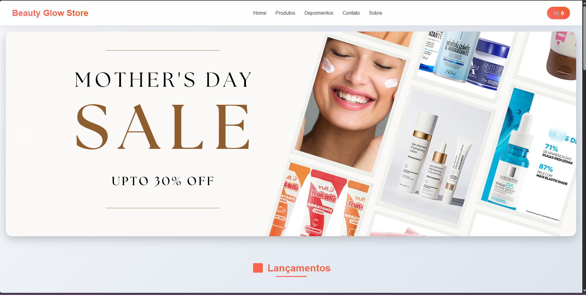
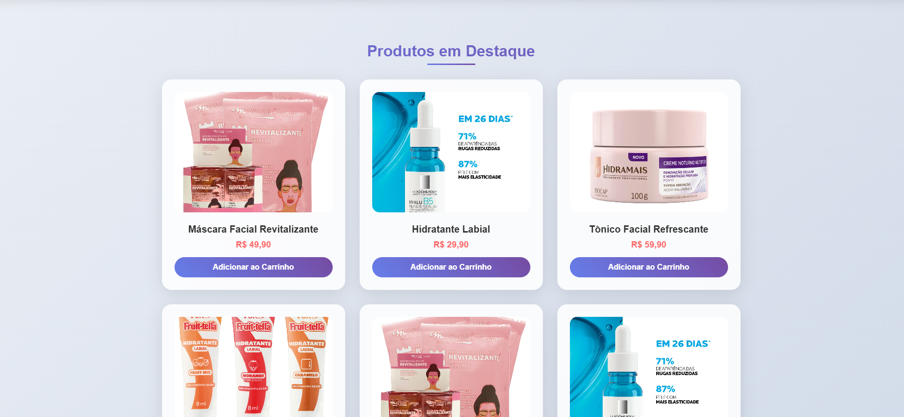

# 🌸 Skincare Store - Beleza Natural

<div align="center">
  
  
  
  
</div>

<div align="center">
  <h3>💄 Uma loja online moderna e elegante para produtos de skincare e beleza</h3>
  <p>Site responsivo com design glassmorphism e animações suaves</p>
</div>

---

## 🔗 Links do Projeto

🌐 **Site Online:** [https://seusite.netlify.app](https://seusite.netlify.app) *(em breve)*  
📱 **Versão Mobile:** Totalmente responsivo  
💻 **Repositório:** [GitHub](https://github.com/seuusuario/skincare-store)  
📧 **Contato:** seuemail@exemplo.com  

---

## 📸 Screenshots

### 🖥️ Desktop

*Página inicial desktop com banner e produtos em destaque*


*Seção de produtos com efeitos glassmorphism*

---

## 🎯 Funcionalidades

### ✨ **Design Moderno**
- 🎨 **Glassmorphism** - Efeitos de vidro e transparência
- 🌈 **Gradientes** - Cores vibrantes e atraentes
- 💫 **Animações** - Transições suaves e efeitos hover
- 📱 **Responsivo** - Funciona perfeitamente em todos os dispositivos

### 🛒 **E-commerce**
- 🛍️ **Carrinho de Compras** - Sistema funcional de carrinho
- 📦 **Catálogo de Produtos** - Exibição organizada dos produtos
- 🆕 **Seção de Lançamentos** - Destaque para novos produtos
- 💰 **Cálculo de Total** - Soma automática dos valores

### 🎪 **Interatividade**
- 🎠 **Carrossel** - Banner rotativo com navegação
- ⌨️ **Navegação por Teclado** - Setas para controlar carrossel
- 🔔 **Notificações** - Feedback visual para ações
- 📜 **Scroll Suave** - Navegação fluida entre seções

### 🎨 **Efeitos Visuais**
- 🌊 **Parallax** - Efeito de profundidade no banner
- 👁️ **Intersection Observer** - Animações on-scroll
- 🎭 **Hover Effects** - Interações visuais nos cards
- 🌟 **Loading States** - Carregamento suave das imagens

---

## 🚀 Como Executar

### 📋 Pré-requisitos
- Navegador web moderno (Chrome, Firefox, Safari, Edge)
- Editor de código (VS Code recomendado)

### 🔧 Instalação

1. **Clone o repositório**
```bash
git clone https://github.com/seuusuario/skincare-store.git
cd skincare-store
```

2. **Estrutura de arquivos**
```
skincare-store/
├── index.html
├── style.css
├── script.js
├── img/
│   ├── banner1.png
│   ├── banner2.png
│   ├── banner3.png
│   ├── prod1.webp
│   ├── prod2.webp
│   ├── prod3.webp
│   └── prod4.webp
├── screens/
│   ├──  desktop-home.png
│   ├──  desktop-produtos.png
└── README.md
```

3. **Execute o projeto**
- Abra o arquivo `index.html` em seu navegador
- Ou use um servidor local:
```bash
# Com Python
python -m http.server 8000

# Com Node.js (live-server)
npx live-server
```

---

## 🛠️ Tecnologias Utilizadas

### **Frontend**
| Tecnologia | Versão | Uso |
|------------|--------|-----|
|  | 5 | Estrutura e semântica |
|  | 3 | Estilos e responsividade |
|  | ES6+ | Interatividade e funcionalidades |

### **Recursos CSS Modernos**
- 🎭 **CSS Grid & Flexbox** - Layout responsivo
- 🌈 **Custom Properties** - Variáveis CSS
- 🎨 **Backdrop Filter** - Efeitos glassmorphism
- 🎪 **CSS Animations** - Transições e keyframes
- 📱 **Media Queries** - Design responsivo

### **APIs JavaScript**
- 🔍 **Intersection Observer** - Animações on-scroll
- ⏰ **SetInterval** - Carrossel automático
- 🎯 **Event Listeners** - Interações do usuário
- 🎨 **DOM Manipulation** - Atualizações dinâmicas

---

## 📱 Responsividade

### 📊 Breakpoints
```css
/* Mobile First */
@media (max-width: 768px) { /* Tablets e mobile */ }
@media (max-width: 480px) { /* Mobile pequeno */ }
@media (min-width: 1200px) { /* Desktop grande */ }
```

### 🎯 Dispositivos Testados

- ✅ Desktop HD (1920px)
- ✅ Desktop 4K (3840px)

---

## 🎨 Paleta de Cores

```css
/* Gradientes Principais */
--primary-gradient: linear-gradient(45deg, #ff6b6b, #ee5a24);
--secondary-gradient: linear-gradient(45deg, #667eea, #764ba2);
--background-gradient: linear-gradient(135deg, #f5f7fa 0%, #c3cfe2 100%);

/* Cores Base */
--white: #ffffff;
--dark: #333333;
--gray: #666666;
--accent: #ff6b6b;
```

---

## 📁 Estrutura do Projeto

```
📦 skincare-store/
├── 🏠 index.html              # Página principal
├── 🎨 style.css               # Estilos e responsividade
├── ⚡ script.js               # Funcionalidades JavaScript
├── 📸 img/                    # Imagens do site
│   ├── 🖼️ banner1.png         # Banner carrossel 1
│   ├── 🖼️ banner2.png         # Banner carrossel 2
│   ├── 🖼️ banner3.png         # Banner carrossel 3
│   ├── 🛍️ prod1.webp          # Produto 1
│   ├── 🛍️ prod2.webp          # Produto 2
│   ├── 🛍️ prod3.webp          # Produto 3
│   └── 🛍️ prod4.webp          # Produto 4
├── 📱 screenshots/            # Capturas de tela
│   ├── 🖥️ desktop-home.png
│   ├── 🖥️ desktop-produtos.png
└── 📖 README.md               # Documentação
```

---

## 🚀 Deploy

### 🌐 **Netlify** (Recomendado)
1. Acesse [netlify.com](https://netlify.com)
2. Arraste a pasta do projeto
3. Seu site estará online!

### 🔗 **Outras Opções**
- **Vercel:** [vercel.com](https://vercel.com)
- **GitHub Pages:** [pages.github.com](https://pages.github.com)
- **Firebase:** [firebase.google.com](https://firebase.google.com)

---

## 🤝 Contribuições

Contribuições são sempre bem-vindas! Siga os passos:

1. 🍴 **Fork** o projeto
2. 🌟 **Crie** uma branch para sua feature
```bash
git checkout -b feature/nova-funcionalidade
```
3. 💾 **Commit** suas mudanças
```bash
git commit -m 'Adiciona nova funcionalidade'
```
4. 📤 **Push** para a branch
```bash
git push origin feature/nova-funcionalidade
```
5. 🔀 **Abra** um Pull Request

---

## 📝 Roadmap

### 🎯 **Próximas Funcionalidades**
- [ ] 💳 Integração com gateway de pagamento
- [ ] 👤 Sistema de login/cadastro
- [ ] ⭐ Sistema de avaliações
- [ ] 🔍 Busca de produtos
- [ ] 💌 Newsletter
- [ ] 🌙 Modo escuro
- [ ] 🛒 Wishlist
- [ ] 📱 PWA (Progressive Web App)

### 🔧 **Melhorias Técnicas**
- [ ] ⚡ Lazy loading de imagens
- [ ] 🗃️ Local Storage para carrinho
- [ ] 📊 Google Analytics
- [ ] 🔍 SEO otimizado
- [ ] ♿ Acessibilidade (WCAG)

---

## 📄 Licença

Este projeto está sob a licença MIT. Veja o arquivo [LICENSE](LICENSE) para mais detalhes.

---

## 👩‍💻 Desenvolvido por

<div align="center">
  
  <br>
  <strong>Karol</strong>
  <br>
  <em>Frontend Developer</em>
  <br><br>
  
  [](https://www.linkedin.com/in/karoline-silva-8070a634b/)
  [](https://github.com/KarolNutty)
</div>

---

<div align="center">
  <h3>💄 Obrigada por visitar o Skincare Store! ✨</h3>
  <p>Se gostou do projeto, não esqueça de dar uma ⭐!</p>
</div>
